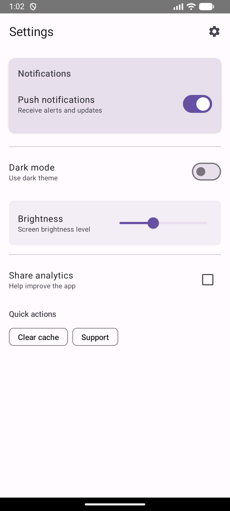

# Assignment 3 – Q2: Box Layout (Profile Header + Overlay Card)

Profile screen with Box layering: header background, circular avatar, and an overlay Card that overlaps the header.

## Requirements checklist
- [x] Box: background, foreground avatar (CircleShape), overlay Card
- [x] contentAlignment, align(...), offset(...)
- [x] Modifiers: clip(CircleShape), offset, zIndex, elevation (Card), aspectRatio
- [x] At least 5 M3: Card, Icon, FilledTonalButton, OutlinedButton, AssistChip, TopAppBar, Surface

## Screenshots

## AI disclosure
AI was used for project setup, debugging (e.g. fixing imports and API references), and README wording. The layout, structure, and implementation were done by me.

## How to run
Open in Android Studio, sync Gradle, run on emulator or device.
